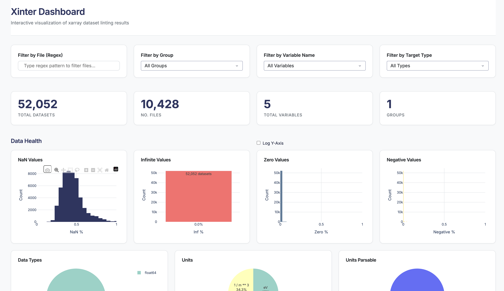
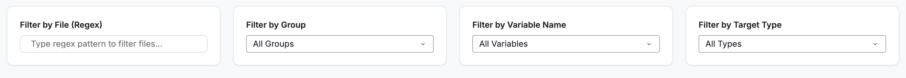
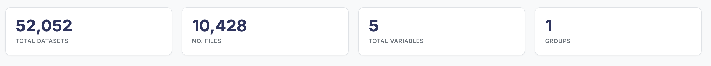
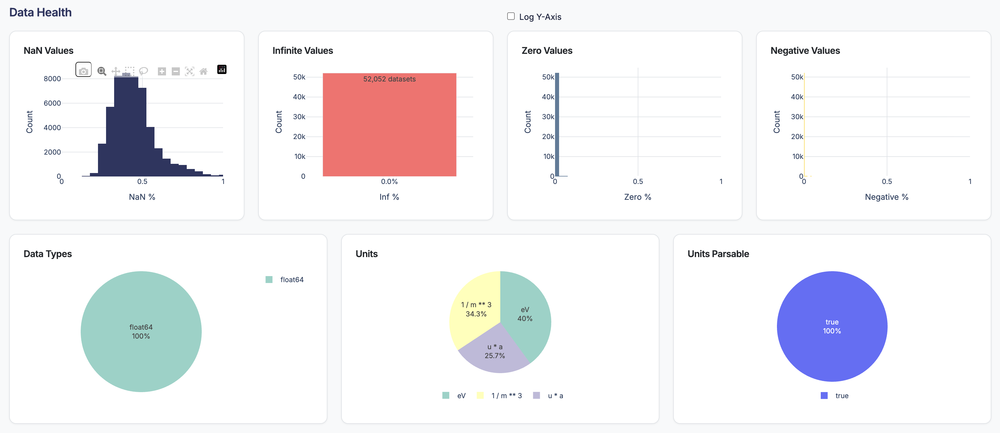
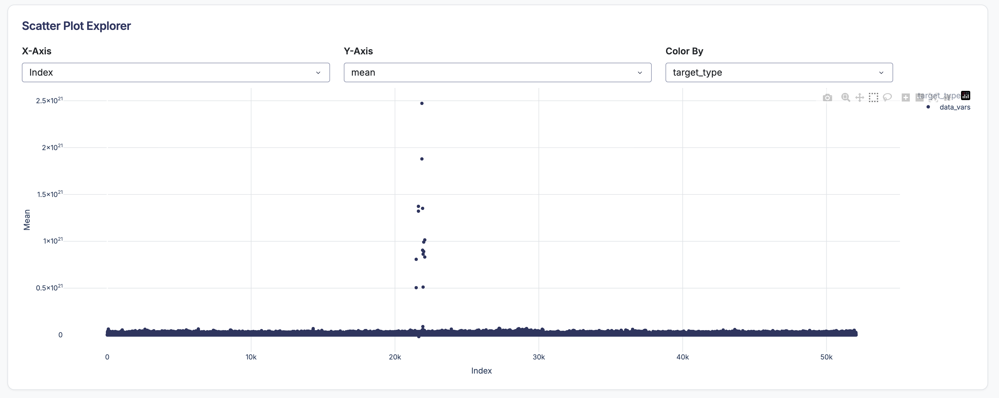
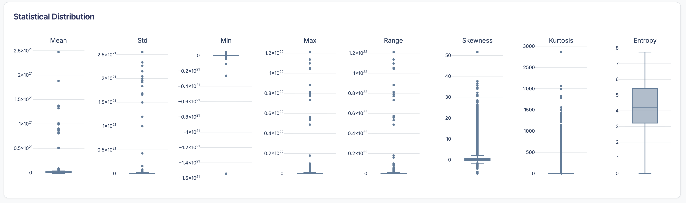
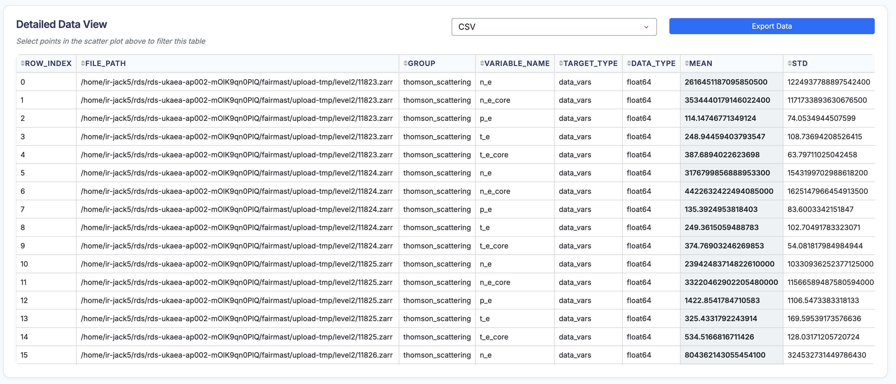

# GUI Dashboard

xinter includes a modern, interactive web-based dashboard for visualizing and exploring linting results. The dashboard is built with Dash and Plotly, providing rich data visualizations and filtering capabilities.

## Overview

The GUI dashboard allows you to:

- 📊 View summary statistics across all linted files
- 🔍 Filter results by file, group, variable, and checker type
- 📈 Visualize data quality metrics with interactive charts
- 📋 Browse detailed results in sortable tables
- 🎨 Explore patterns with customizable scatter plots

## Launching the Dashboard

### Step 1: Generate Results

First, lint your datasets and save the results to a Parquet file:

```bash
xl mydata.zarr --output results.parquet
```

For multiple files:

```bash
xl data/*.zarr --output all_results.parquet
```

!!! tip "Saving Results"
    The `--output` flag saves all linting results to a Parquet file, which is required for the dashboard. Parquet format is chosen for its efficiency with large datasets.

### Step 2: Launch the Dashboard

Use the `xl-gui` command to start the dashboard:

```bash
xl-gui results.parquet
```

This will start a local web server and automatically open your browser to the dashboard (typically at `http://127.0.0.1:8050`).


## Dashboard Interface

<figure markdown="span">
  { width="800" }
  <figcaption>Xinter GUI Dashboard</figcaption>
</figure>

The dashboard consists of several key sections:

### Filters Panel


<figure markdown="span">
  { width="800" }
  <figcaption>Xinter GUI Filters Panel</figcaption>
</figure>

Four filter controls help you narrow down the data:

#### File Filter (Regex)
Filter datasets by filename using regular expressions.

- **Example:** `experiment_.*\.zarr` matches all Zarr files starting with "experiment_"
- **Example:** `2024.*` matches files with "2024" in the name

#### Group Filter
For hierarchical datasets, filter by group path.

- Select "All Groups" to see all groups
- Select specific group paths (e.g., `/equilibrium`, `/diagnostic`)

#### Variable Name Filter
Filter by specific variable names.

- Select "All Variables" to see all variables
- Select individual variables (e.g., `temperature`, `pressure`)

#### Target Type Filter
Filter by whether the checked item is a data variable or a coordinate.

- **data_vars**: Regular data variables
- **coords**: Coordinate arrays

### Metrics Cards

<figure markdown="span">
  { width="800" }
  <figcaption>Xinter GUI Metrics Cards</figcaption>
</figure>

Four summary cards show key statistics:

- **Total Files**: Number of unique files in the dataset
- **Total Variables**: Number of unique variables checked
- **Total Checks**: Total number of linter checks performed
- **Success Rate**: Percentage of checks that passed

These metrics update automatically based on your active filters.

### Visualizations

#### Data Health Charts

<figure markdown="span">
  { width="800" }
  <figcaption>Xinter GUI Data Health Charts</figcaption>
</figure>

Several charts provide insights into data quality:

- **NaN Distribution**: Histogram showing the percentage of NaN values across variables
- **Infinite Values**: Histogram showing the percentage of infinite values
- **Zero Values**: Histogram showing the percentage of zero values
- **Negative Values**: Histogram showing the percentage of negative values
- **Data Type Distribution**: Pie chart showing the distribution of data types (float, int, etc.)
- **Units Distribution**: Pie chart showing the types of units found in the dataset
- **Units parsable**: Pie chart showing how many variables have parsable units vs. unparseable units

#### Scatter Plot

<figure markdown="span">
  { width="800" }
  <figcaption>Xinter GUI Scatter Plot</figcaption>
</figure>

Create custom visualizations by selecting any two numeric metrics.

**Controls:**

- **X-axis dropdown**: Choose metric for horizontal axis
- **Y-axis dropdown**: Choose metric for vertical axis  
- **Color dropdown**: Choose metric or category for point colors

**Examples:**

- Plot `mean` vs `std` colored by `variable_name` to see relationships
- Plot `nan_percent` vs `iqr` to identify quality issues
- Plot `size` vs `range` colored by data type

**Interaction:**

- **Zoom**: Click and drag to zoom into regions
- **Pan**: Hold shift and drag to pan
- **Hover**: See detailed information for each point
- **Reset**: Double-click to reset view
- **Select**: Click and drag to select points and view details in the table

#### Statistical Distributions

<figure markdown="span">
  { width="800" }
  <figcaption>Xinter GUI Statistical Distributions</figcaption>
</figure>

For numeric metrics, view box plots to understand the overall data quality landscape. This is dynamic based on your filters, allowing you to compare distributions across different groups or variable types.


### Detailed Results Table

<figure markdown="span">
  { width="800" }
  <figcaption>Xinter GUI Detailed Results Table</figcaption>
</figure>

A comprehensive, sortable table shows all linting results:

**Columns:**

- **file**: Dataset filename
- **group**: Group path (if applicable)
- **target**: Whether it's a data variable or coordinate
- **variable_name**: Name of the variable
- **checker**: Name of the linter that ran
- **value**: The computed value
- **message**: Human-readable result message
- **success**: Whether the check passed (True/False)

**Features:**

- **Sort**: Click column headers to sort
- **Filter**: Use the filter row to search within columns
- **Page**: Navigate through large result sets
- **Export**: Copy or export filtered data